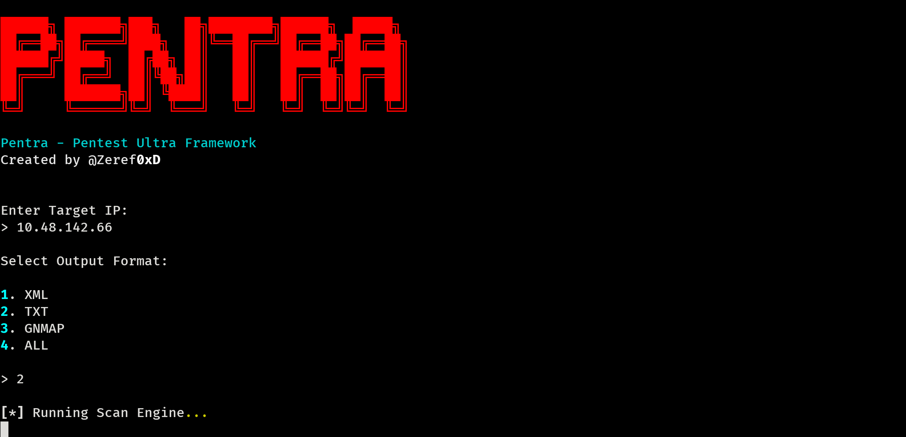
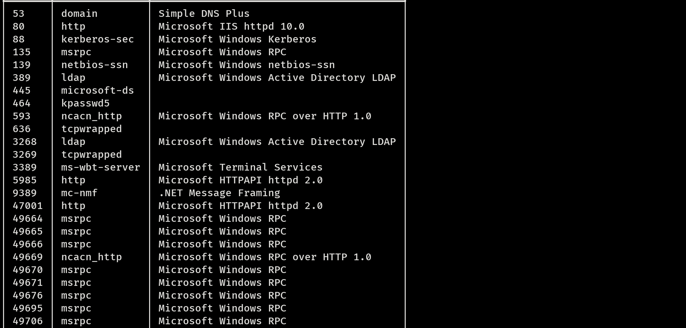
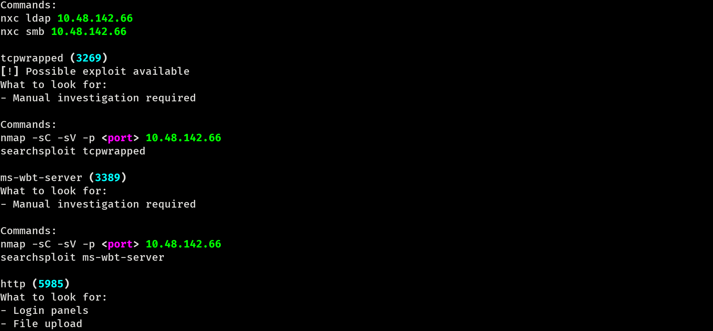

# Pentra - Pentest Ultra Framework

Pentra is an intelligent pentesting assistant designed to automate reconnaissance, analyze scan results, and provide actionable next-step guidance.

Unlike traditional scanners, Pentra does not just display results — it helps the user understand what to do next based on discovered services.

---

## Features

* Smart Nmap scanning with automatic `-Pn` fallback when ping fails
* Service-based analysis (works on any port, not just common ones)
* CVE detection using `searchsploit`
* Clean and structured output (no raw Nmap clutter)
* Priority-based findings (HIGH / MED / LOW)
* Built-in enumeration guidance for services
* Multi-format output support:

  * XML (Metasploit compatible)
  * TXT
  * GNMAP
* Interactive CLI workflow (user input driven)

---

## How It Works

Pentra follows a structured pentesting workflow:

```
Scan → Parse → Analyze → Detect → Guide → Suggest
```

---

## Requirements

Make sure the following are installed:

* Python 3
* Nmap
* searchsploit (ExploitDB)
* Python modules:

  ```
  pip install rich
  ```

---

## Installation

```
git clone https://github.com/Zeref0xD/Pentra.git
cd Pentra
```

---

## Usage

```
sudo python3 Pentra_V8.py
```

---

## Example Workflow

1. Enter target IP
2. Select output format
3. Pentra runs scan engine (Nmap)
4. Displays:

   * Open ports
   * Priority findings
   * Service analysis
   * CVE alerts
   * Enumeration commands

---

## Output Formats

Pentra supports multiple output formats:

* XML → for parsing and Metasploit (`db_import`)
* TXT → human-readable report
* GNMAP → grep-friendly format
* ALL → generates all formats together

---

## Why Pentra

Most tools stop at scanning.

Pentra focuses on:

* Interpreting results
* Guiding the next steps
* Reducing manual thinking during reconnaissance

---
## Screenshots

### Scan Output


### Analysis and Findings


### Enumeration Guidance


## Author

Zeref0xD

---

## Disclaimer

This tool is intended for educational purposes and authorized security testing only. Unauthorized use is strictly prohibited.
